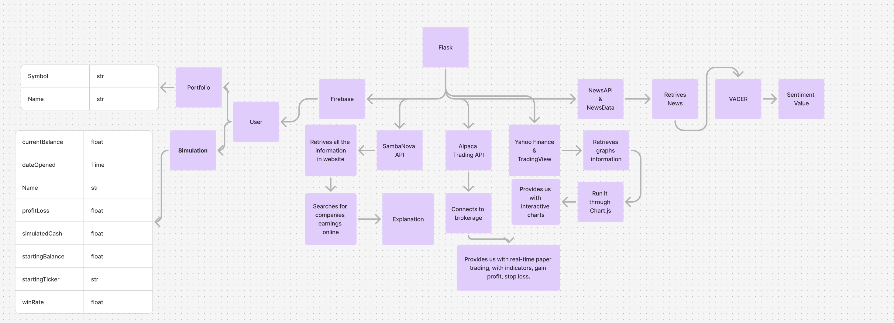

# Stock Portfolio Management System

## Overview

This project is a **Stock Portfolio Management System** built with Flask for the backend and React for the frontend. It allows users to track stocks, view stock charts, manage a virtual portfolio, create trading simulations, and analyze news sentiment.

---

## Inspiration

The inspiration for this project came from the need to provide users with a simple yet powerful tool to track their financial portfolios, simulate trading strategies, and stay updated with market trends. The introduction of **Ticker**, an AI assistant, adds a conversational dimension to financial management, making it more intuitive and user-friendly.

---

## What it does

WaveCap allows users to:
- Manage and track their stock portfolio.
- Visualize stock performance with interactive candlestick and line charts.
- Simulate trading strategies with customizable paper trading simulations.
- Analyze market sentiment based on recent news articles.
- Access daily top stock gainers and financial insights via **Ticker**, an AI-powered assistant.
- Generate text-to-image visualizations using Cloudflare's API integration.

### **Ticker**: AI Assistant for Financial Support
Ticker is a friendly chatbot designed to assist users with:
- Answering financial and stock-related queries.
- Providing investment advice powered by the SambaNova AI model.
- Delivering actionable insights for portfolio management and trading strategies.

---

## How we built it

### Data Structure

### Backend:
- **Flask** framework for building APIs.
- **Firebase Authentication and Database** for secure user login and account management.
- **Firestore** as the primary database for storing user data and portfolios.
- **Yahoo Finance API** for fetching real-time stock data and historical information.
- **NewsAPI** and **NewsData.io API** for gathering news articles for sentiment analysis.
- **VADER Sentiment Analysis** for sentiment scoring.
- **Alpaca Trading API** for integrating virtual trading features.
- **SambaNova API** for Ticker's conversational AI capabilities.
- **Cloudflare API** for generating dynamic text-to-image visualizations.

### Frontend:
- **React** for building a responsive and interactive user interface.
- **Chart.js** for rendering stock performance graphs.
- **React Router** for navigation between portfolio, simulations, and stock views.
- **Custom CSS** for styling components, including the Ticker chatbot.

---

## Challenges we ran into

1. **Data Accuracy**: Ensuring data fetched from APIs like Yahoo Finance and Alpaca was accurate and displayed in real-time.
2. **Sentiment Analysis**: Processing news articles efficiently and providing meaningful sentiment scores.
3. **Simulation Management**: Handling simulation state and ensuring user data integrity across the dashboard.
4. **AI Integration**: Developing Ticker to provide reliable and contextually accurate financial insights.
5. **Cloudflare API**: Ensuring smooth integration for text-to-image visualizations.
6. **User Experience**: Balancing functionality with simplicity for a seamless user experience.

---

## Accomplishments that we're proud of

- Successfully integrating **Ticker** as an AI-powered financial assistant.
- Implementing interactive and dynamic chart visualizations for stock data.
- Creating a robust simulation feature for paper trading, helping users practice trading strategies.
- Incorporating Cloudflare's API for generating text-to-image outputs, adding a creative element.
- Building a responsive and user-friendly frontend interface.
- Developing sentiment analysis features for actionable news insights.

---

## What we learned

- The importance of managing API rate limits and handling errors gracefully.
- Effective methods for visualizing financial data using Chart.js.
- Techniques for integrating conversational AI into web applications.
- Insights into the stock market and trading strategies.
- Leveraging Cloudflare's text-to-image API for enhancing interactivity.
- Collaborative problem-solving and debugging in a complex application.

---

## What's next for WaveCap

1. **Advanced AI for Ticker**: Enhance Ticker with predictive analytics and personalized financial recommendations.
2. **Mobile App**: Develop a mobile version of the platform for easier accessibility.
3. **Real-Time Updates for Simulation**: Add live stock price updates for an enhanced user experience.
4. **Community Features**: Introduce forums and leaderboards for users to share strategies and simulations.
5. **Expanded Financial Tools**: Add budgeting and expense-tracking features to complement portfolio management.
6. **Enhanced Visualizations**: Use Cloudflare's text-to-image API for creating customizable charts and infographics.

---

## Features

### Backend (Flask):
- **User Authentication**: Signup, login, and logout using Firebase Authentication.
- **Portfolio Management**: Save, remove, and view stocks in your portfolio.
- **Stock Data Visualization**: Fetch and display stock data using Yahoo Finance and Chart.js.
- **Trading Simulations**: Create paper trading simulations and manage virtual trading data.
- **News Sentiment Analysis**: Analyze company news sentiment using NewsAPI and VADER sentiment analysis.
- **Top Gainers**: Fetch daily top-gaining stocks.
- **Ticker AI Assistant**: Conversational financial insights powered by SambaNova.
- **Cloudflare Integration**: Text-to-image visualizations for enhanced interactivity.

### Frontend (React):
- **Search Functionality**: Autocomplete stock suggestions and view stock details.
- **Interactive Charts**: Candlestick and line charts for stock performance visualization.
- **Dashboard**: Manage simulations and monitor trading performance.
- **Paper Trading**: Simulate trading with custom parameters.
- **Ticker Chatbot**: Chat interface for financial advice and insights.

---

## APIs Used

### Firebase
- **Purpose**: Authentication and Firestore database for storing user and portfolio data.

### Yahoo Finance API
- **Purpose**: Fetch stock details, historical data, and chart information.

### NewsAPI
- **Purpose**: Retrieve news articles related to specific companies for sentiment analysis.

### NewsData.io API
- **Purpose**: Provide alternative sources for company-related news.

### VADER Sentiment Analysis
- **Purpose**: Perform sentiment analysis on company news to determine positive, negative, or neutral sentiment.

### FinHub API
- **Purpose**: Access real-time market data and stock-related information.

### SambaNova API
- **Purpose**: AI-powered financial insights and investment-related recommendations for **Ticker**.

### Alpaca Trading API
- **Purpose**: Enable paper trading simulations and manage virtual trading accounts.

### Cloudflare API
- **Purpose**: Generate text-to-image visualizations for interactive and creative outputs.
